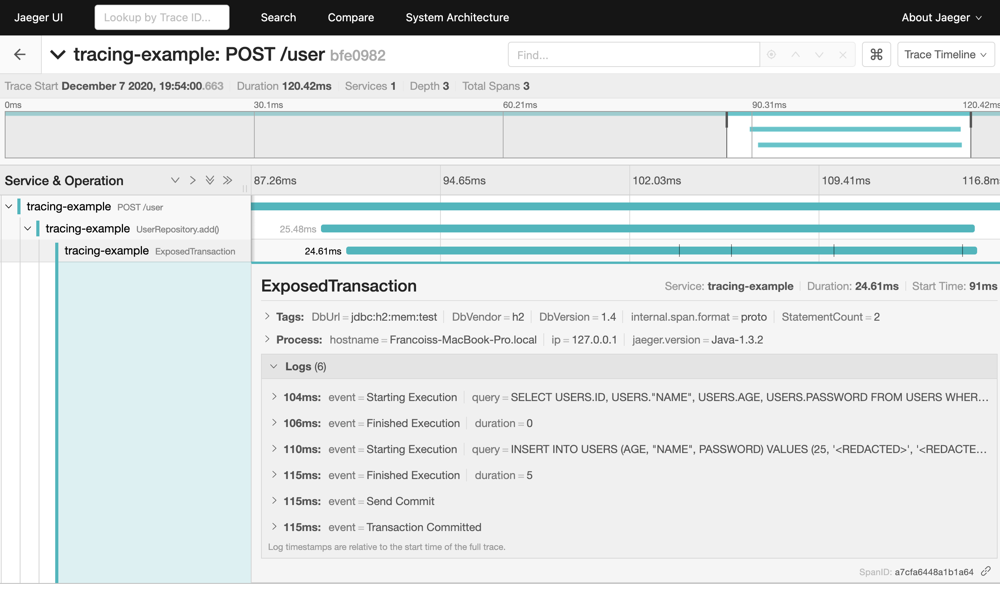

[](https://github.com/{userName}/{repoName}/actions)

# Exposed OpenTracing

[OpenTracing](https://opentracing.io/) instrumentation of [Exposed](https://github.com/JetBrains/Exposed). Observe database transactions with spans tagged with query strings, table names and more. Logs execution start/ending, transaction commit and rollback. Santise queries to safeguard PII.

## Usage

In an application with a tracer registered in [GlobalTracer](https://opentracing.io/guides/java/tracers/#global-tracer), replace your [Exposed](https://github.com/JetBrains/Exposed) `transaction` with a `tracedTransaction`:

```kotlin
tracedTransaction(contains = NoPII) {
    Cities.insert {
        it[name] = "St. Petersburg"
    } 
}
```
The execution will be wrapped with a child [span](https://opentracing.io/docs/overview/spans/) of the previously active span, which will be tagged with the SQL query. If your query contains PII that you do not want to leak to the tracing system, pass the sensitive strings to the call as follows:
```kotlin
tracedTransaction(name, password, contains = PII) {
    Users.insert {
        it[Users.username] = username
        it[Users.name] = name
        it[Users.password] = password
    } 
}
```
The `name` and `password` strings with be replaced with `<REDACTED>` in the query tagged on the span.
If no strings are password with `contains = PII` or if a string is passed with `contains = NoPII`, a warn log will be written, and the transaction will execute without tracing. 

The resulting `ExposedTransaction` span looks as follows in [Jaeger](https://www.jaegertracing.io/):



